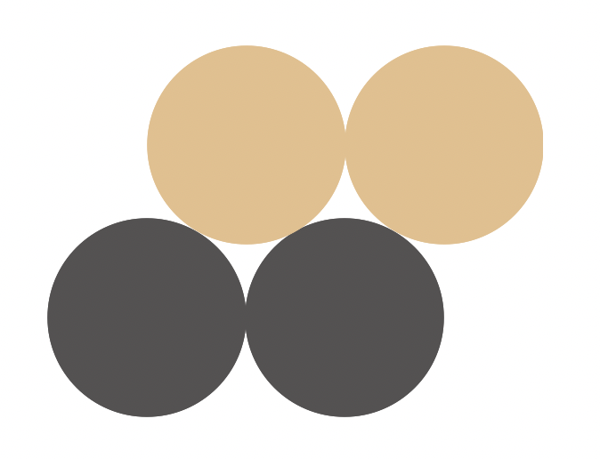
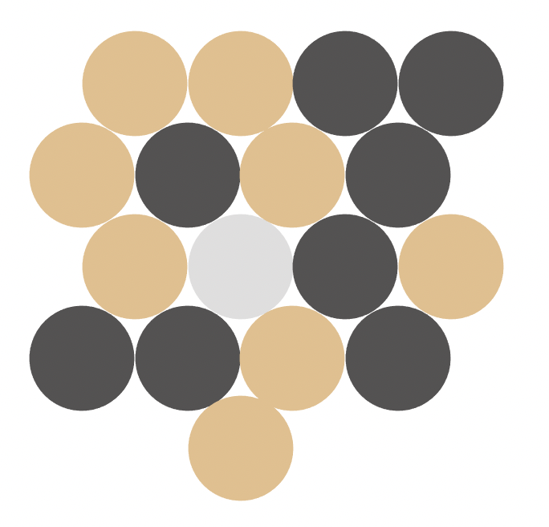

# Onoro Solver <!-- omit from toc -->

A solver for the game of Onoro, invented by a friend's uncle.

## Table of Contents <!-- omit from toc -->
- [How the game is played](#how-the-game-is-played)
  - [Phase 1](#phase-1)
    - [Examples](#examples)
  - [Phase 2](#phase-2)
    - [Examples](#examples-1)

## How the game is played

The game of Onoro is a two-player perfect-information competitive game played on
a flat surface. Each player has 8 pawns (from chess), the first player has black
pawns and the second has white.

The goal of the game is to have four pawns in a row. The first player to do so
wins. Additionally, if a player has no legal moves, they lose.

### Phase 1

The game starts by placing three pawns in a triangle shape, with two black pawns
and one white pawn.

Then, players alternate placing pawns, starting with the white player. The rules
for placing pawns are:

* Each pawn placed must touch at least two existing pawns. This will force all
  pawns to align to an infinite hexagonal grid.

#### Examples

Here are the possible moves white can make as their first move:

### Phase 2

Since each player has 8 pawns, they will eventually run out of pawns to place.
After both players have placed all of their pawns, phase 2 of the game starts.

In phase 2, instead of placing pawns, players may move one of their pawns
somewhere else. The following additional constraints are applied:

* After moving the pawn, no pawn may be left connected to only one pawn.
* After moving the pawn, all pawns must form one contiguously connected group.
  I.e., you may not split the board into two separate groups.

Note that when moving a pawn, these rules may temporarily be violated. As long
as the rules are satisfied after the moved pawn is placed, the move is legal.

#### Examples

Assume this is the current board state, and it's black's turn. All pawns have
been placed, so it's phase 2.

Here's an example of a legal move black could make, moving the grayed out pawn.

Here's an example of an illegal move. The red pawn can't be moved to where the
grayed-out pawn is because it would leave the pawn to the left of it only
connected to one other pawn.

Here is a legal move where that same pawn is moved. This is legal because the
pawn that would be stranded otherwise is connected to two pawns after the moved
pawn is placed.

